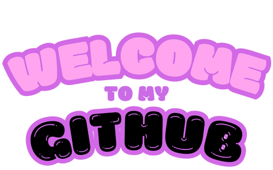

  
 

  

 

  
  

---
### About Me
- 🌱 **Always Learning**: Currently diving into cloud platforms, CI/CD pipelines, and web servers like Nginx and Apache.
- 🛠️ **Tinkerer at Heart**: Love testing out new architectures and finding innovative solutions.
- 🖥️ **Dev & Ops Enthusiast**: Exploring **WordPress**, **MySQL**, and beyond to build and optimize scalable systems
- 🌍 **Future-Focused**: Eager to contribute to projects.
---

### Technologies I'm Exploring
- **Cloud Platforms** ☁️: AWS, Azure, GCP
- **Web Servers** 🌐: Nginx, Apache
- **Database Systems** 💾: MySQL, PostgreSQL
- **CI/CD Pipelines** 🔄: Jenkins, GitHub Actions, GitLab CI
- **CMS Platforms** 🛠️: WordPress
- **Security Technologies** 🔒: Firewalls, SSL/TLS, HashiCorp Vault, Docker Secrets

  

  
---

### My Goals
- Integrate AI models to web applications.
- Automate everything with CI/CD.
- Master web server configurations to improve performance and security.
- Deepen understanding of security technologies and best practices.
- Continuously challenge myself with new tools and technologies.

---
  Feel free to check out my repositories and projects. I'm always open to feedback and collaboration. Let's innovate together! 

